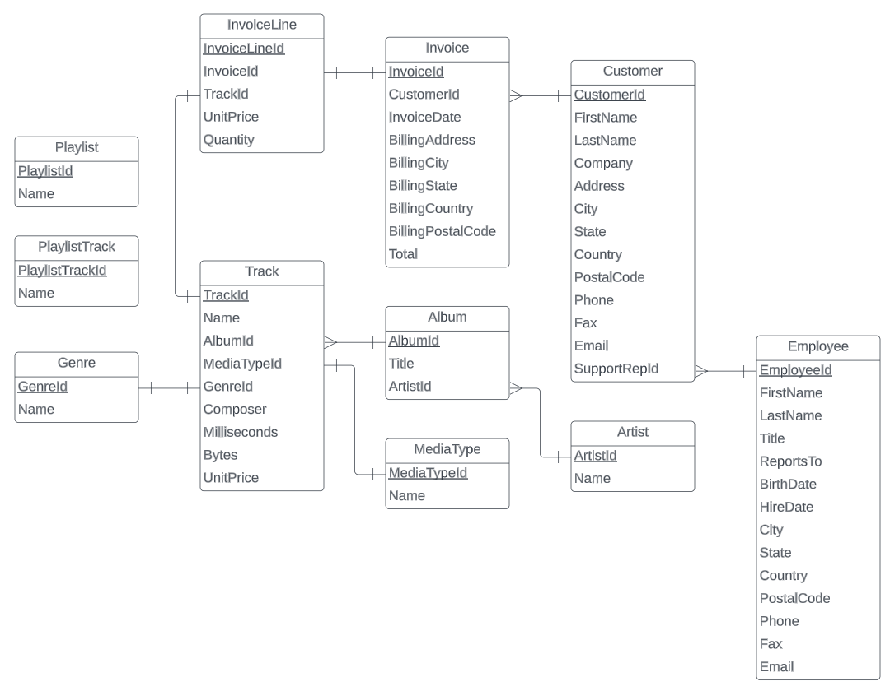

## SQL Practice

#### WSDA Music ERD

#### DB Schema

Album
- AlbumId: int
- Title: nvarchar(160)
- ArtistId: int

Artist
- ArtistId: int
- Name: nvarchar(120)

Customer
- CustomerId: int
- FirstName: nvarchar(40)
- LastName: nvarchar(20)
- Company: nvarchar(80)
- Address: nvarchar(70)
- City: nvarchar(40)
- State: nvarchar(40)
- Country: nvarchar(40)
- PostalCode: nvarchar(10)
- Phone: nvarchar(24)
- Fax: nvarchar(24)
- Email: nvarchar(60)
- SupportRepId: int

Employee
- EmployeeId: int
- FirstName: nvarchar(40)
- LastName: nvarchar(20)
- Title: nvarchar(30)
- ReportsTo: int
- BirthDate: datetime
- HireDate: datetime
- City: nvarchar(40)
- State: nvarchar(40)
- Country: nvarchar(40)
- PostalCode: nvarchar(10)
- Phone: nvarchar(24)
- Fax: nvarchar(24)
- Email: nvarchar(60)

Genre
- GenreId: int
- Name: nvarchar(120)

Invoice
- InvoiceId: int
- CustomerId: int
- InvoiceDate: datetime
- BillingAddress: nvarchar(70)
- BillingCity: nvarchar(40)
- BillingState: nvarchar(40)
- BillingCountry: nvarchar(40)
- BillingPostalCode: nvarchar(10)
- Total: numeric(10,2)

InvoiceLine
- InvoiceLineId: int
- InvoiceId: int
- TrackId: int
- UnitPrice: numeric(10,2)
- Quantity: int

MediaType
- MediaTypeId: int
- Name: nvarchar(120)

Playlist
- PlaylistId: int
- Name: nvarchar(120)

PlaylistTrack
- PlaylistTrackId: int
- TrackId: int

Track
- TrackId: int
- Name: nvarchar(200)
- AlbumId: int
- MediaTypeId: innt
- GenreId: int
- Composer: nvarchar(220)
- Milliseconds: int
- Bytes: int
- UnitPrice: numeric(10,2)
